# 🎬 KekikStreamAPI

**Modern, self-hosted medya streaming platformu**  
Kendi yayın merkezinizi kurun! 🚀

---

## 🚦 Ne Sunar?

KekikStreamAPI, [KekikStream](https://github.com/keyiflerolsun/KekikStream) kütüphanesini web arayüzü ve API ile birleştirerek uçtan uca bir streaming deneyimi sağlar.

- 🎥 Çoklu kaynak desteği: Onlarca kaynaktan içerik arama ve izleme  
- 🌐 Modern Web Arayüzü: Responsive, kullanıcı dostu UI  
- 🔌 RESTful API: Kolay entegrasyon  
- 🎬 yt-dlp entegrasyonu: YouTube ve 1000+ site desteği

---

## 🚀 Hızlı Başlangıç

> Gereksinimler: Python 3.11+, `yt-dlp` ve tarayıcı.

### Manuel Kurulum

```bash
pip install -r requirements.txt
python basla.py
```

👉 Tarayıcınızdan erişin: **http://127.0.0.1:3310**

---

## 🧭 Mimari ve Akış

```mermaid
graph TB
    Client[🌐 Client]

    subgraph KekikStreamAPI[🎬 KekikStreamAPI]
        FastAPI[⚡ FastAPI Core :3310]
        Home[🏠 Web UI]
        API[🔌 API]
    end

    subgraph External[🌍 External Sources]
        KekikStream[📚 KekikStream]
        MediaSources[🎥 Media Sources]
        YtDlp[🎬 yt-dlp]
    end

    KekikStream <--> MediaSources
    KekikStream <--> YtDlp

    Client -->|HTTP| FastAPI

    FastAPI --> Home
    FastAPI --> API

    Home <--> API

    API <--> KekikStream

    style KekikStreamAPI fill:#2b2a29,stroke:#ef7f1a,stroke-width:2px
    style External fill:#242322,stroke:#0087a3,stroke-width:2px
```



---

## 🎯 Kullanım Senaryoları

### 🌐 Web Arayüzü

- Ana sayfa, arama, kategori filtreleme  
- Sinematik video oynatıcı  
- Mobil/desktop uyumlu tasarım

### 🔌 API Endpoints

| Endpoint                     | Açıklama            |
|------------------------------|---------------------|
| `/api/v1/health`             | API sağlık kontrolü |
| `/api/v1/get_plugin_names`   | Tüm eklenti listesi |
| `/api/v1/get_plugin`         | Eklenti detayları   |
| `/api/v1/search`             | İçerik arama        |
| `/api/v1/get_main_page`      | Kategori içerikleri |
| `/api/v1/load_item`          | İçerik detayları    |
| `/api/v1/load_links`         | Video bağlantıları  |
| `/api/v1/extract`            | Link extraction     |
| `/api/v1/ytdlp-extract`      | yt-dlp video bilgisi |

---

## 📖 API Örnekleri

```bash
# Eklenti listesi
curl http://127.0.0.1:3310/api/v1/get_plugin_names

# Arama
curl "http://127.0.0.1:3310/api/v1/search?plugin=Dizilla&query=vikings"

# İçerik detayları
curl "http://127.0.0.1:3310/api/v1/load_item?plugin=Dizilla&encoded_url=..."

# Video bağlantıları
curl "http://127.0.0.1:3310/api/v1/load_links?plugin=Dizilla&encoded_url=..."
```

**Response Formatı:**
```json
{
  "results": [
    {
      "title": "Vikings",
      "url": "...",
      "thumbnail": "...",
      "description": "..."
    }
  ]
}
```

---

## 🛠️ Eklenti Geliştirme (KekikStream)

Yeni medya kaynakları eklemek için [KekikStream](https://github.com/keyiflerolsun/KekikStream) repo'suna katkıda bulunun:

```python
from KekikStream.Core import PluginBase, MainPageResult, SearchResult, MovieInfo, SeriesInfo, ExtractResult

class MyPlugin(PluginBase):
    name        = "MyPlugin"
    language    = "en"
    main_url    = "https://example.com"
    favicon     = f"https://www.google.com/s2/favicons?domain={main_url}&sz=64"
    description = "MyPlugin description"

    main_page   = {
      f"{main_url}/category/" : "Category Name"
    }

    async def get_main_page(self, page: int, url: str, category: str) -> list[MainPageResult]:
        # Ana sayfa implementasyonu
        return results

    async def search(self, query: str) -> list[SearchResult]:
        # Arama implementasyonu
        return results

    async def load_item(self, url: str) -> MovieInfo | SeriesInfo:
        # İçerik detayları
        return details

    async def load_links(self, url: str) -> list[ExtractResult]:
        # Video bağlantıları
        return links
```

---

## 🌐 Telif Hakkı ve Lisans

*Copyright (C) 2026 by* [keyiflerolsun](https://github.com/keyiflerolsun) ❤️️  
[GNU GENERAL PUBLIC LICENSE Version 3, 29 June 2007](https://github.com/keyiflerolsun/KekikStreamAPI/blob/master/LICENSE) *Koşullarına göre lisanslanmıştır.*

---

<p align="center">
  Bu proje <a href="https://github.com/keyiflerolsun">@keyiflerolsun</a> tarafından <a href="https://t.me/KekikAkademi">@KekikAkademi</a> için geliştirilmiştir.
</p>

<p align="center">
  <sub>⭐ Beğendiyseniz yıldız vermeyi unutmayın!</sub>
</p>
